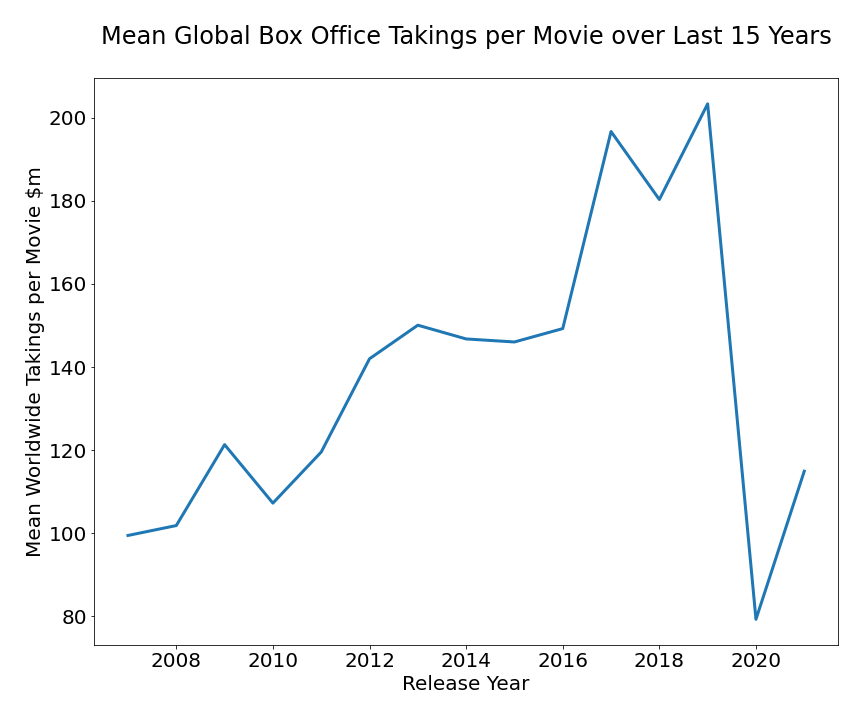

## Project Overview

This project analyzes the last 15 years of box office takings to produce recommendations for Microsoft Studio on which type of movies it should produce, when it should release them and the features the movies should include.

Descriptive analysis of movie attributes and financial performance shows that Thriller films provide the best chance of success, particularly in the Mystery/Horror subgenres, with a runtime of around 100 minutes and budget of around $25 million.

It also shows that the market is not yet recovering from the pandemic lockdowns

Microsoft Studio can use this analysis to produce movies that have most chance of turning a healthy profit

### Business Problem

To turn a profit for stakeholders, making efficient use of a realistic budget for the studio's first movies. This relies on recruiting the right crew, with a track record of producing profitable and acclaimed movies, and including features most associated with successful movies

 

### The Data

Data drawn from three sources:

*  **Box office performance of more the 6,000 movies from The Numbers website**
*  **Genre, crew, and release date of each movie from Open Movie Database (OMDB)**
    This also contains average user ratings from Rotten Tomatoes, imdb and Metacritic**
*  **Keywords attached to each movie from The Movie DB (TMDB)**

### Methods

The worldwide box office takings for the last 15 years were analysed to give a general trend

Each movie released in the last 15 years was ranked using a combination of gross box office profit and return on investment, giving a way of comparing the performance of movies with different budgets

The best ranked movies were then analysed to find the most profitable genres

Within those genres, the movies were analysed to find which actors, directors and writers were most successful, the runtimes most associated with hits and the budget likely to be needed

### Results
*  **Box office takings are still down sharply on pre-pandemic levels, with no recovery so far in 2021**

*  **The Thriller genre produced the best box office performing movies with a realistic start-up budget ($20 -30 million)**
*  **Action/Adventure movies represent a riskier but potentially more profitable option once the studio is established**

*  **Within the Thriller genre, the sub-genres of Horror and Mystery were most associated with hits**

 
 

*  **Rose Byrne, Patrick Wilson have been the most profitable actors in the Thriller/Mystery/Horror genre**

*  **Jordan Peele and James Wan have been the most profitable directors and writers in the genre**

 
 

 

 
 

 
 

*  **The most successful films in the genre have a runtime of around 110 minutes**

 

### Conclusion

This analysis leads to three recommendations for Microsoft Studio to make succesful movies

*  **TIMING -** Wait until the market recovers before releasing movies, with July 2022 and February 2023 potential target dates

*  **FEATURES -** Early movies should be in the Thriller genre, with Thriller/Horror/Mysteries offering the best chance of early success 
 They should have a $20 - $30 million budget and a runtime of 94 to 100 minutes. The studio should think about Action/Adventure movies once it has etablished a reputation
 
*  **PERSONNEL -** The studio should recruit Rose Byrne and Patrick Wilson in early movies, and Jordan Peele to write and direct

### Next steps

*  Collect as much information as possible from the top 10 global markets to see if they are recovering from the pandemic
 
*  Conduct surveys to see which types of film people want to see after the pandemic

*  Collect data on the view count of movies on streaming services compared with the cinema

*  So far the value of a movie in the streaming market has generally been linked to its box office performance, data needs to be collected to track whether this trend is changing
