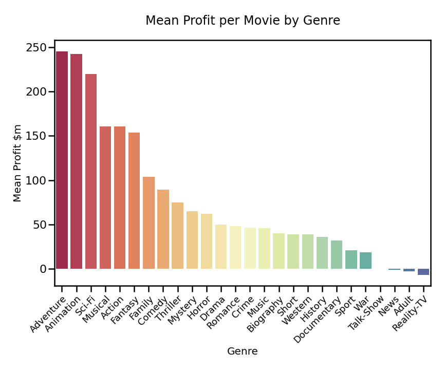
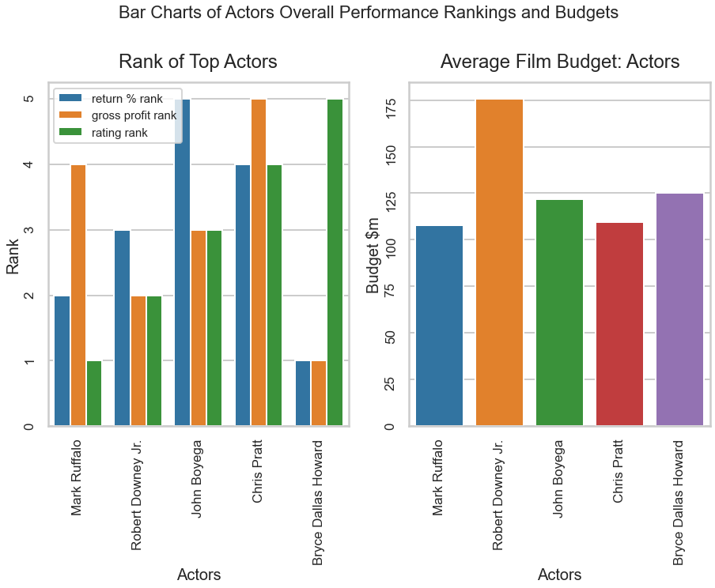
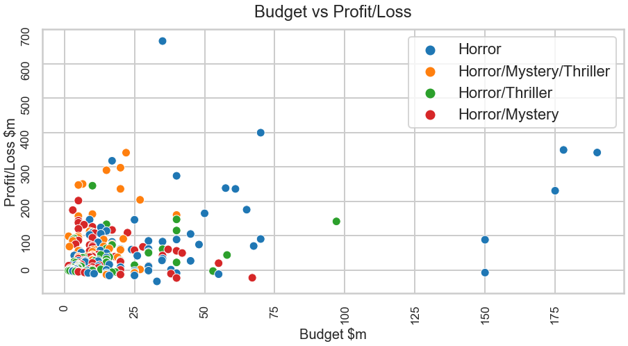
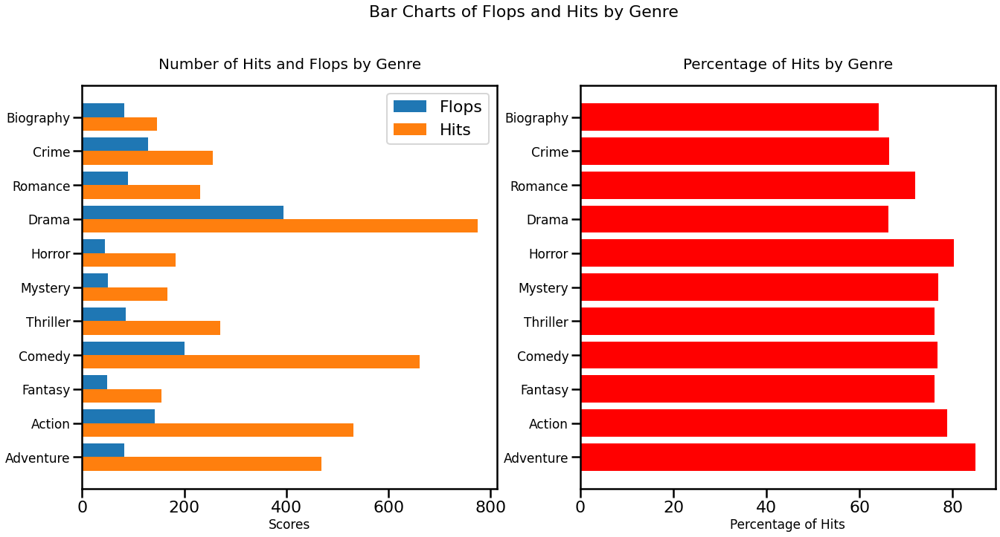

## Project Overview

This project analyzes the last 15 years of box office takings to produce recommendations for Microsoft Studio on which type of movies it should produce, when it should release them and the features the movies should include.

Descriptive analysis of movie attributes and financial performance shows that high budget Action/Adventure/Sci-Fi movies generate the biggest profits, with a runtime of over 137 minutes, a budget of betweeen $150 and $250 million and a relase month of April or December.
Mark Ruffalo has been the most profitable actor in the genre, and Joss Whedon the most profitable director/writer.
Lower budget Horror/Mystery/Thrillers gave the best return on investment, with a runtime of between 96 and 116 minutes, a budget of $20 to $25 million and a release month of July. 
Patrick Wilson and Rose Byrne have been the best box office performing and user rated actors in the genre, with Jordan Peele the best performing writer/director.

It also shows that the market has barely begun to recover from the pandemic lockdowns

Microsoft Studio can use this analysis to produce movies that have most chance of turning a healthy profit

### Business Problem

To turn a profit for stakeholders, making efficient use of a realistic budget for the studio's first movies. This relies on recruiting the right crew, with a track record of producing profitable and acclaimed movies, and including features most associated with successful movies

 

### The Data

Data drawn from three sources:

*  **Box office performance of more the 6,000 movies from The Numbers website**
 *  **Genre, crew, and release date of each movie from Open Movie Database (OMDB)**
    This also contains average user ratings from Rotten Tomatoes, imdb and Metacritic**
*  **Keywords attached to each movie from The Movie DB (TMDB)**

### Methods

The worldwide box office takings for the last 15 years were analysed to give a general trend

Each movie released in the last 15 years was anlaysed in terms of profit/loss and return on investment to find the best performing genres

Within those genres, the movies were analysed to find which actors, directors and writers were most successful, the runtimes most associated with hits and the budget likely to be needed

### Headline Results
*  **Box office takings per movie are still down sharply on pre-pandemic levels, with small signs of recovery so far in 2021**

* **Adventure/Action/Sci-Fi movies represent generated the most profit per movie**

* **The most profitable movies in the genre operated with a budget of $150 to $250 million**

* **Mark Ruffalo was the best performing actor in the genre, with Joss Whedon and JJ.Abrams among the top performing directors**

* **Horror/Mystery/Thriller movies genre generated the best return on investment...**

* **...on a lower budget...**

* **...and also offered the best chance of making a profit**

### Conclusion

This analysis leads to three recommendations for Microsoft Studio to make succesful movies, on the general timing of releases, the type of high budget movies it should make and what type of lower budget movies it should focus on

* **General Timing** - The first movies should be released until the world's top 10 markets have fully reopened from lockdown - subject to the pandemic

**High Budget**

* **Genre** - The studio's high budget movies should be in the Adventure/Sci-Fi/Action genre
* They should have a budget of between 150 and 250 million dollars
* The studio should target Mark Ruffalo and/or Bryce Dallas Howard as lead actors
* It should target Joss Whedon as director and writer, or JJ Abrams as director
* The movies should be over 137 minutes long and be released in April, December, November or June

**Low Budget**

* **Genre** - The studio's low budget movies should be in the Horror/Mystery/Thriller genre
* They should have a budget of between 20 and 25 million dollars
* The studio should target Rose Byrne and/or Patrick Wilson as lead actors
* It should target Jordan Peele as director and writer
* The movies should be between 96 and 116 minutes long and be released in July, March and February

### Next steps

*  Collect as much information as possible from the top 10 global markets to see if they are recovering from the pandemic
 
*  Conduct surveys to see which types of movies people want to see after the pandemic

*  Collect data on the view count of movies on streaming services compared with the cinema as theatres reopen around the world

